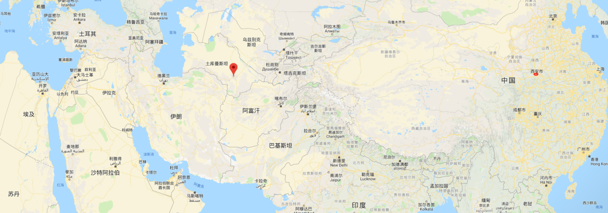
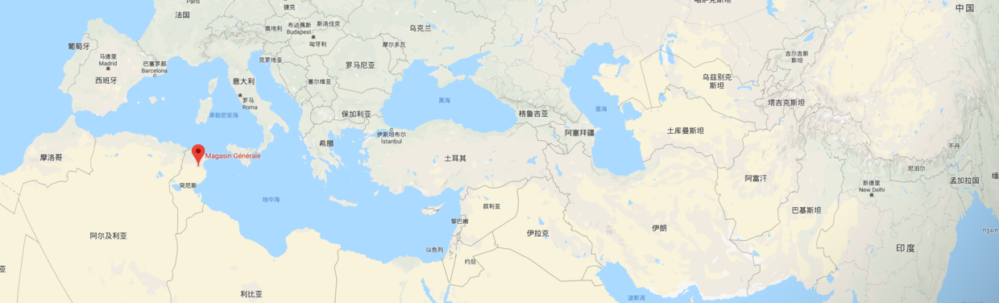
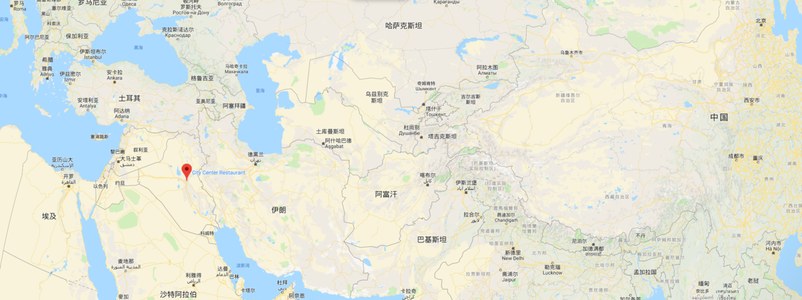
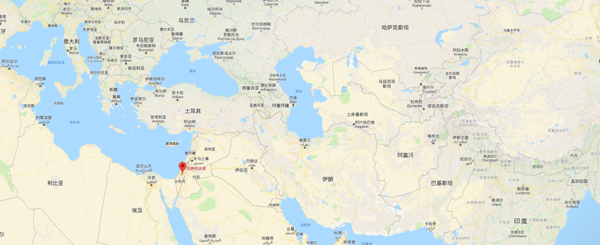
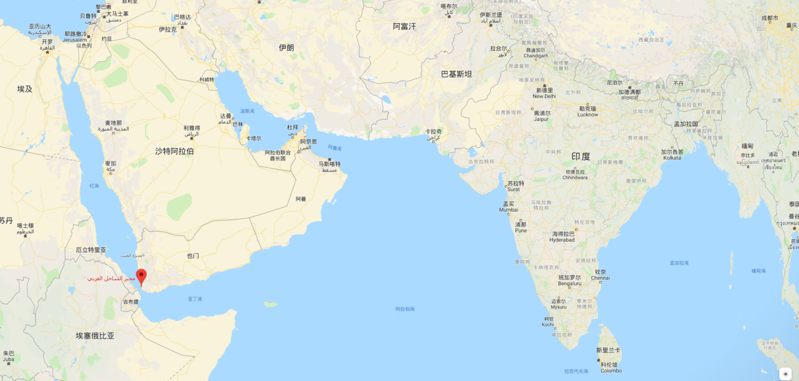
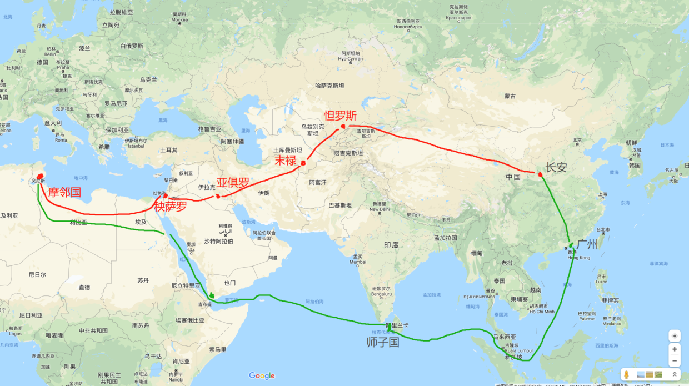

# 大唐长安人杜环在两河流域, 耶路撒冷和北非的行程

>一个西安人, 去了巴格达, 耶路撒冷和北非, 回国后写了游记. 这挺正常的. 但是这件事发生在1300年前的唐朝, 就显得有些神奇了. 花了点时间整理了下这个唐朝的长安人杜环在海外的10年经历.

公元751年, 当时世界上最大的两个帝国, 大唐与阿拉伯阿拔斯帝国(史称黑衣大食), 在大唐西域怛(`da, 二声`)罗斯进行了一场战役. 怛罗斯, 位于现在哈萨克斯坦Talas附近. 大唐军队的统帅是镇西节度使高仙芝, 率领约2万唐军, 以及约5万番军(西域诸国军队), 共7万人. 阿拉伯军队的统帅是当时阿拉伯帝国忽逻姗省的最高长官, 艾布·穆斯林. 

战役的结果是大唐军队战败, 高仙芝仅率数千唐军逃回大唐. 我国史书几乎不提怛罗斯之战, 这是一场不光彩的失败, 但也确实不是伤筋动骨的失败. 阿拉伯史书倒是有更详细的记载: 杀五万唐番联军, 俘虏两万人.  唐长安人杜环, 就是被俘唐军中的一员. 杜环在怛罗斯战役10年后, 即公元762年, 坐商船在广州登陆, 重新回到大唐领土. 是的, 他在哈萨克斯坦被俘, 在广州的码头回国. 

回国后, 杜环把他十年的见闻写成一本书<经行记>, 杜佑是杜环家族的长辈, 在编撰的《通典》里, 收录了《经行记》里的一部分内容, 共1500多字. 这些内容, 主要是对大唐以西诸国的介绍, 不包含杜环的个人事迹.

《经行记》原书, 现在已经散佚, 没人找得到了. 不仅书找不到, 杜环详细的生卒年, 我们现在也无法知道. 只有杜佑在《通典》里对杜环的介绍:
    
>族子杜环, 随镇西节度使高仙芝西征, 天宝十载至西海. 宝应初, 因贾商船舶, 自广州而回.           -- 杜佑《通典》

## 土库曼斯坦的新年
《经行记》里写了一个叫末禄国的地方. 末禄国, 是现在的土库曼斯坦马雷市. 当时是阿拉伯帝国东方行省忽逻姗的首府, 也就是怛罗斯战役中阿拉伯军队统帅艾布`穆斯林的大本营. 

杜环对末禄国出产的水果蔬菜, 牲畜特产, 以及宗教习俗, 都有很详细的描写:

>在亚梅国西南七百余里. 胡姓末者, 兹土人也. 其城方十五里, 用铁为城门, 城中有盐池, 又有两所佛寺, 其境东西百四十里, 南北百八十里, 村栅相接, 树木交映, 四面合匝, 总是流沙, 南有大河, 流入其境, 分渠数百, 灌溉一州.

>其土沃饶, 其人洁净. 墙宇高厚, 市鄽平正, 木既雕刻, 土亦绘画. 又有细软叠布, 羔羊皮裘, 估其上者, 值银钱数百. 果有红桃，白㮈, 遏白黄李, 瓜大者名寻支, 十余人飡一辄足. 越瓜长四尺以上, 菜有蔓菁, 萝卜, 长葱, 颗葱, 芸台, 胡苽, 葛蓝, 军达, 茴香, 英薤, 瓠芦, 尤多葡萄. 又有黄牛, 野马, 水鸭, 石鸡, 

以上描写, 是末禄国当时的位置与物产. 下面这段是末禄国的习俗与宗教. 其中的`西海`, 是指地中海.

>其俗以五月为岁, 每岁以画缸相献. 有打球节, 秋千节, 其大食东道使镇此. 从此至西海以来, 大食波斯, 参杂居止, 其俗礼天, 不食自死肉及宿肉, 以香油涂发.

所有关于末禄国的说明, 都没有杜环个人的经历, 他与他所在的唐军部队, 是如何辗转从怛罗斯来到末禄? 他们在那里待了多久?  

后来的学者只能从 `其俗以五月为岁`推断出一些信息. 末禄当时采用伊斯兰历, 伊历每年的1月1日与大唐当时使用的历法, 都有相当的差别. 也就是说, 伊历纪年的1月1日, 并不总是大唐历法的5月. 这就类似于现在的农历大年初一, 有时候是在公历1月下旬, 有时候是在公历2月中旬.  经过推算, 公元755年至757年这三年, 伊历的1月1日, 位于大唐历法的5月. 所以, 杜环在755年至757年之间, 很有可能还只是停留在土库曼斯坦一带. 这种依靠其它方法推测杜环行程的事情, 后面还有好几个....

这个时候他如果回国, 也只能重走来时的路, 往东返回.

 杜环在末禄国度过了新年(途中红色标记) 

## 北非叛乱

阿拉伯帝国并不太平, 在公元755年, 忽逻姗行省的总督, 怛罗斯战役击败唐军的艾布·穆斯林, 在权力斗争中被杀. 当时的国王, 叫阿浦恭弗(也叫曼苏尔), 经过几次人员任命后, 最后让他的弟弟作忽逻姗总督. 

同时, 在阿拉伯帝国西方, 有一个叫摩邻的地方发生叛乱. 摩邻国(Maghrib), 位于今天的北非突尼斯和利比亚一带, 阿浦恭弗为了解决叛乱, 从忽逻姗调集3万军队, 前往平叛.  杜环所在的唐军部队, 应该就是被编入平叛军队, 一起前往摩邻国平叛, 给了杜环游历中亚和北非的机会.

摩邻国, 其首府位于今突尼斯凯鲁万(图中红点标记), 杜环随军前往平叛

目前杜佑收录的《经行记》里, 并没有记载杜环离开末禄前往摩邻的原因, 对这场平叛战争更是只字未提, 所有关于摩邻国的记述就是下面这段话:

> 又去摩邻国, 在秧萨罗国西南, 渡大碛, 行二千里至其国. 其人黑, 其俗犷, 少米麦, 无草木, 马食干鱼, 人餐鹘莽. 鹘莽, 即波斯枣也, 瘴疬特甚.

杜环和阿拉伯军中的其他士兵应该在北非吃了不少苦头, 杜环来自遥远的大唐, 其他阿拉伯士兵的家乡, 也是中亚土库曼斯坦一带, 到了北非, 没有米麦, 马只能吃鱼干, 人要靠突尼斯椰枣充饥. 杜环记的`瘴疬特甚`可能是水土不服导致生病, 也可能是军队中发生了一场瘟疫.

根据阿拉伯史书记载, 摩邻平叛结束的时间是公元761年8月左右. 公元757年时, 杜环应该还在中亚的土库曼斯坦一带(书中所写末禄国), 末禄国距离摩邻国的陆地直线距离, 达4000多千米. 杜环在757年至761年这4年, 从土库曼斯坦马雷市出发, 横穿今天的两河流域, 叙利亚, 埃及, 最终到达突尼斯.

## 两河流域的繁华, 以及大唐老乡

杜环从末禄国随军出发, 先是往西到达了阿拉伯帝国的腹地, 杜环在《经行记》中将其记载为`亚俱罗(Aqual音译)`, 也就是两河流域, 这里是人类文明的发祥地之一.  杜环对亚俱罗的记载篇幅较长, 下面是第一段:

>大食, 一名亚俱罗, 其大食王号暮门, 都此处.其士女环伟长大, 衣裳鲜洁, 容止闲丽. 女子出门, 必拥蔽其面. 无问贵贱, 一日五时礼天, 食肉作斋, 以杀生为功德.系银带, 佩银刀, 断饮酒, 忌音乐. 人相争者, 不至殴击.

杜环对亚俱罗中人们宗教信仰的记述, 也是中国古代对伊斯兰教最早最准确的描述. 其中, 杜环说大食王号`暮门`, 这里的`暮门`, 是 `Amir al-Mu'mimin` 的省略音译, 意为"信仰者的领袖". 《旧唐书·大食传》, 将该词音译为 `噉密莫末腻`. 

同时, 杜环还记录了亚俱罗的繁华.

>法唯从宽, 葬唯从俭, 郛廓之内, 里闬之中, 土地所生, 无物不有, 四方辐辏, 万货丰贱, 锦绣珠贝, 满于市肆. 驼马驴骡, 充于街巷, 刻石蜜为卢舍, 有似中国宝舆. 每至节日, 将献贵人, 琉璃器皿, 鍮石瓶钵, 盖不可数算.粳米白面, 不异中华. 其果有楄桃, 又千年枣, 其蔓菁根大如斗而圆, 味甚美, 余菜亦与诸国同.

>绫绢机杼, 金银匠, 画匠, 汉匠起作画者, 京兆人樊淑, 刘泚, 织络者, 河东人乐阫, 吕礼.

在都城繁华的介绍里, 杜环记下了他在都城里遇到的四名大唐老乡: 京兆(长安)人樊淑, 刘泚, 河东人乐阫, 吕礼. 河东是今天的山西省运城市, 位于西安以东约200千米. 按照行军速度推算, 杜环到达两河流域的时间, 应该是公元758年, 此时距离怛罗斯战役已经7年. 在距大唐遥远的阿拉伯帝国腹地, 在被俘7年后, 杜环(应该还有其他唐军战俘)见到了四名大唐老乡. 他们肯定聊了很多. 杜环是长安人, 樊淑和刘泚也是长安人, 他们在聊天的时候, 或许还能聊出一些共同认识的人, 聊一些共同经过的事, 比如某年的新年, 长安里有什么热闹的集会. 

我每次想到杜环特意记下樊淑, 刘泚, 乐阫和吕礼四个人的名字, 杜佑也将这四人收录进《通典》, 就挺感慨的. 杜佑收录的《经行记》里, 没有击败大唐军队的阿拉伯军统帅艾布·穆斯林的名字, 没有阿拉伯王阿浦恭弗的名字, 甚至没有提摩邻平叛这件事, 但是专门记下了四个大唐工匠. 可能杜佑和杜环, 是觉得在遥远异国的大唐工匠们, 应该留下他们的名字, 让后人们知道这件事. 

《经行记》里记录大食王定都于亚俱罗. 不过亚俱罗是阿拉伯帝国的一处行省,是一大片区域, 杜环这段对都城的记述, 就像是一个外国人到了大唐后记录说  “大唐皇帝定都关中”. 那杜环所说的都城到底是现在的哪个城市? 这也不能怪杜环, 当杜环到达两河流域时, 阿拉伯帝国阿拔斯王朝还处在比较动荡的时期, 当时的阿拉伯王的宫殿, 几经变化, 没有固定, 杜环哪年到的两河流域, 我们都只是推测, 他到达两河流域时, 阿拉伯王如果搬了家, 估计也会让杜环很糊涂吧, 所以杜环干脆就简单记录, 只说都城就在亚俱罗行省那片地区.

可能只有从全本《经行记》里才能找到都城位置的确切线索, 换句话说, 我们可能再也无法确知了. 但是学者宋岘经过一番考证和推论, 将杜环与四名大唐老乡相遇的地点, 定在了巴格达. 嗯, 就是现在的伊拉克首都, 巴格达.

杜环记录的大食首都, (推测为)现在的巴格达(图中红色标记)

推论为巴格达的理由是, 杜环在亚俱罗停留的时间, 据推测应该在公元758年-760年之间, 另外根据阿拉伯文献的记录, 巴格达城在758年开始兴建. 且在修建时, 阿拉伯王身边已经有了忽逻姗军队作为近卫军. 忽逻姗省首府, 就是杜环待了很久的末禄国, 杜环等大唐士兵被收编入的, 就是阿拉伯帝国忽逻姗军队. 此外, 为了修建巴格达城, 阿拉伯王阿浦恭弗从阿拉伯帝国境内征召了10万工匠, 樊淑等人, 应该是随这十万工匠到达巴格达的. 而他们之前在阿拉伯帝国的什么地方, 杜环走后, 他们有没有离开巴格达, 回到长安和河东道, 我们也就永远不知道了.

杜环要继续随军往西前往北非, 樊淑等可能也为他饯了行. 如果是在长安饯行, 要折柳相赠, 不清楚巴格达当时有没有柳树, 如果没有柳树的话, 想来杜环也只能与樊师傅他们互道一声珍重了. 在辛弃疾的想象中, 即将回到汉长安城的苏武和被匈奴俘虏的将军李陵在北海惜别, 为此写了千古名句:
> 向河梁, 回头万里, 故人长绝.   -- 《贺新郎·别茂嘉十二弟》(辛弃疾)

这次, 是被俘虏的杜环会再回到长安.

## 耶路撒冷
杜环继续往西, 经过了一个叫`秧萨罗`的地方. 目前保留下来的《经行记》, 对秧萨罗并没有像末禄, 亚俱罗, 摩邻那样详细的说明, 只是在说摩邻国时, 提到 :

>又去摩邻国, 在秧萨罗国西南, 渡大碛, 行二千里至其国

这个不起眼的"秧萨罗", 就是著名的三大宗教圣地, 耶路撒冷. 当时阿拉伯语为 "Urishilam", 杜环音译为 "秧萨罗". 
杜环在描述大食亚俱罗的风俗时, 记载了下面的阿拉伯王礼拜的情景.

>又有礼堂, 容数万人. 每七日, 王出礼拜, 登高座为众说法曰: "人生甚难, 天道不易, 奸非劫窃, 细行谩言, 安己危人, 欺贫虐贱, 有一于此, 罪莫大焉. 凡有征战, 为敌所戮, 必得生天, 杀其敌人, 获福无量". 率土禀化, 从之如流.

其中透露了与之前末禄国 `五月为岁` 类似的线索, 那就是杜环身处一个可以容纳数万人的礼堂(清真寺), 在听阿拉伯王为士兵们讲道. 杜佑把这段描述放在了杜环对亚俱罗地区的描述里, 但是当时亚俱罗地区, 没有可容纳数万人的清真寺. 因此关于这个清真寺在什么地方, 有两个推论:

1. 白寿彝考证此清真寺是位于麦加的“克尔白”清真寺.
2. 宋岘考证此清真寺为耶路撒冷的阿萨克清真寺.

其中, 宋岘推论讲道发生在耶路撒冷, 是因为: 耶路撒冷是杜环明确提到的地点, 杜环所在军队是经耶路撒冷继续往西前往摩邻国, 且阿拉伯王的讲道对象是士兵, 似乎是战前动员, 因此耶路撒冷阿萨克清真寺是比较合理的推论.
 
 

耶路撒冷(图中红色标记)

另外, 应该就是在耶路撒冷附近, 杜环真正看到了他在《经行记》中提到了多次的“西海” -- 地中海, 在整个中国历史上, 能够走到地中海的人是屈指可数的. 杜环, 以及同行的其他唐军士兵, 也算是完成了一个很特殊的成就吧. 

耶路撒冷继续往西, 杜环所在军队到达了叛乱发生地, 摩邻国, 并于公元761年8月平定叛乱. 之后, 杜环踏上了回国的商船.

## 海路回国
现存的《经行记》没有记载摩邻国平叛之后, 杜环是何时, 通过何种方式脱离军队, 又是在何处登上回大唐的商船. 只有杜佑在通典中简单的介绍:

>(杜环)宝应初, 因贾商船舶, 自广州而回

宝应初年, 是公元762年4月至公元763年1月. 摩邻平叛成功, 是公元761年8月, 所以可以推测, 杜环应该是在平叛成功后就启程返回大唐, 而没有再往东折返回巴格达. 杜环应该是在红海上的某个港口, 踏上了商船. 从突尼斯到红海的港口, 杜环要经过富庶的埃及尼罗河流域. 合理地脑补一下, 杜环可能也见到了宏伟的金字塔了吧, 或许还有狮身人面像. 

不过, 我没有找到较准确的杜环登船港口的考证.

红海至印度洋的出海口(图中红色标记)

## 后记
下图是我非常粗糙地标记出来的, 杜环的十年经行路线. 从长安募兵, 前往西域, 经历怛罗斯之战被俘后, 随阿拉伯军队抵达末禄国. 在滞留末禄数年后, 又随军队前往两河流域, 经耶路撒冷并最终到达北非摩邻国, 平定当地叛乱. 之后在红海港口搭乘商船, 经斯里兰卡, 马六甲海峡, 抵达广州港口, 并返回长安城. 

图画地真的非常粗糙. 我甚至没有准确标记出几个重要地点的经纬度. 其中红色的线路, 是杜环前往北非的线路, 绿色的线路, 是杜环海路回到广州的路线.

推测出的杜环十年的游历路线(手绘, 很粗糙)

需要注意的是, 因为《经行记》只保留了1500多字, 而杜环十年间的行程路线, 以及途经各地在今天的具体位置, 都是经过多名学者考证各种史料推论得出的. 《经行记》中还提到了另外一些国家和文化习俗, 其中明显有部分是杜环没有到访过, 只是听说的国家, 也有一些国家我们至今无法确知它们是今天的哪个地区. 

即便是本文所写的摩邻国, 在《经行记》中也没有明确表明杜环确实去过, 且去摩邻国是为了平叛, 只能依据杜环的详细描述推测他去过摩邻国, 并结合阿拉伯史料中的摩邻平叛事件, 推测杜环是随军队前往.

即便如此, 杜环的经历, 也已经远超同时代人的认知, 在我通过各种资料了解杜环的行程路线时, 感到很是震撼, 心里一遍又一遍重复一个不太雅观的词, 以w和c开头的. 即使放在今天, 让一个普通人通过现代交通工具完成这趟旅途, 面对沿途各国的语言, 饮食, 习俗, 宗教的差异, 也要作周全的准备和心理建设, 旅途中可能还会不止一次地想要赶快回家. 

而杜环是以战俘的身份被迫开始这段十年的旅程, 期间还要参加战斗. 以当时的医疗水平, 在战场负伤或者染上比较严重的疾病, 都可能危及生命. 杜环能够成功回到大唐长安城, 已经算是一个很大的奇迹了.

只是杜环写的《经行记》, 没有这么好的运气, 到现在只保留了1500字, 就像1960年岑仲勉先生说杜佑没有将《经行记》全本纳入《通典》, 真的是 “天壤见一憾事”.

## 参考文献
>1. 《经行记笺注》(张一纯著), 华文出版社, 2017年8月第一版. (张一纯在1960年完成《经行记笺注》, 这本书是2017年再版, 并添加下面几篇更新的研究成果)
>2. 《杜环游历大食国之路线考》 宋岘, 1997-11-01, 明清之际中国和西方国家的文化交流——中国中外关系史学会第六次学术讨论会论文集. (收录于参考文献1中)
>3. 《唐代中国文化与巴格达城的兴建——(唐)杜环 <经行记> 新证之一》宋岘, 1998-01, 海交史研究. (收录于参考文献1中)
>4.  《亚俱罗考》 宋岘 (收录于参考文献1中)
>5. 《杜环与耶路撒冷》 宋岘 (收录于参考文献1中)
>6. 《从怛罗斯战役说到伊斯兰教之最早的华文记录》 白寿彝 1936年 (收录于参考文献1中)
